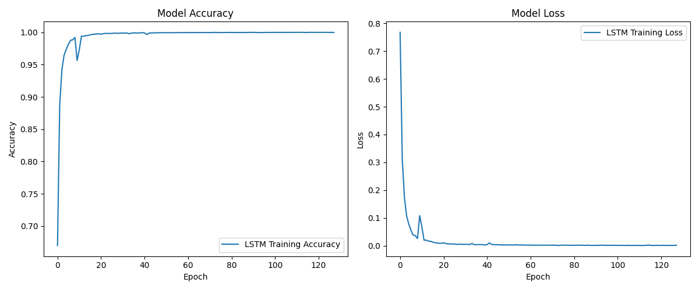

# Motion Metrics

Identify human daily activities using on-device IMU and nerual network models, using [Motion Sense](https://github.com/mmalekzadeh/motion-sense.git) [dataset](https://www.kaggle.com/api/v1/datasets/download/malekzadeh/motionsense-dataset)

At the top level, you can get the full list of parameters by running:

```bash
cd path/to/this/repo && python src/python/training.py --help
```

For example, run:

```bash
cd path/to/this/repo && python src/python/training.py --epochs 128 --batch-size 32
```

or directly:

```bash 
cd path/to/this/repo && python src/python/training.py 128 32
```

will train a model with 128 epochs and a batch size of 32.

## Model Architecture


## Latest Results
| Model | Accuracy |  Loss  | Epochs | Batch Size |
|-------|----------|--------|--------|------------|
| LSTM  | 0.9702   | 0.3753 | 128    | 32         |

`documents/training_output.txt` contains the full training output results.